# drift — Architecture Decay Detector

Catch your codebase drifting into chaos, one commit at a time.

<p align="center">
  
</p>
<p align="center">
  
</p>

## Install

```bash
pip install pyyaml
pip install -e .
```

## Usage

```bash
drift init      # Create .drift.yaml in current directory
drift check     # Run all checks
drift diff      # Compare against main branch
drift diff HEAD~1  # Compare against previous commit
drift log       # View score history
```

### Flags

```
--path=<dir>    Scan a specific directory (default: .)
--config=<path> Use a specific config file (default: .drift.yaml)
```

## Config

Define architecture rules in `.drift.yaml`:

```yaml
rules:
  # API must not depend on DB layer directly
  - rule: "API layer must not import database modules directly"
    type: forbid_import
    from: "src/api/**"
    forbid:
      - "src/db/**"
      - "src/models/**"

  # No circular imports between modules
  - rule: "No circular imports between modules"
    type: no_circular
    paths:
      - "src/**"

  # Enforce file size discipline
  - rule: "Keep source files under 500 lines"
    type: max_lines
    path: "src/**"
    limit: 500

  # Prevent the utils/ dumping ground
  - rule: "Utils directory should not become a dumping ground"
    type: max_files
    path: "src/utils/**"
    limit: 15
```

## Rule Types

| Type | Description | Parameters |
|---|---|---|
| `forbid_import` | Files in `from` must not import from `forbid` paths | `from`, `forbid` |
| `no_circular` | Detect circular imports in given paths | `paths` |
| `max_lines` | Enforce max lines per file | `path`, `limit` |
| `max_files` | Enforce max files in a directory | `path`, `limit` |

## How It Differs

Most architecture tools are language-specific or require heavy setup. `drift` works on **any** project with Python or JavaScript/TypeScript code, with a single YAML file and zero runtime dependencies.

**Drift runs on itself.** Every commit is checked against `.drift.yaml` — currently scoring **100/100**.

## License

MIT
